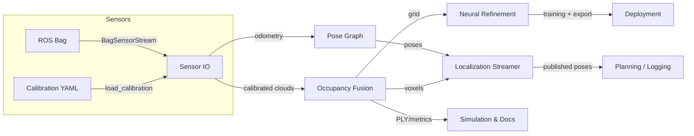

# Architecture Overview

The system is organized around five layers:

1. **Sensor IO** – ROS bag ingestion and calibration loading (`hd_map_builder/sensors`). Provides calibrated extrinsics/intrinsics and timestamped raw messages.
2. **Mapping Core** – Occupancy grid fusion and semantic accumulation (`hd_map_builder/mapping`). Multi-sensor point clouds are projected into the vehicle frame and update log-odds voxels.
3. **Localization** – Pose graph manager (`hd_map_builder/localization`) and streaming helpers (`pipeline/localization_stream.py`) keep track of vehicle pose estimates and publish them in real time.
4. **Neural Refinement** – PyTorch decoder, datasets, training loop, and export/profiling utilities (`hd_map_builder/neural_repr`). Converts occupancy data into neural implicit maps.
5. **Pipelines & Tooling** – Offline builder, replay CLI, simulation runner, PLY/ONNX exporters, and localization streamer (`pipeline/*`, `scripts/*`).

All components are designed to work offline (unit tests) and via CLI demos to avoid heavy runtime dependencies while keeping the structure close to an eventual ROS/embedded deployment.
